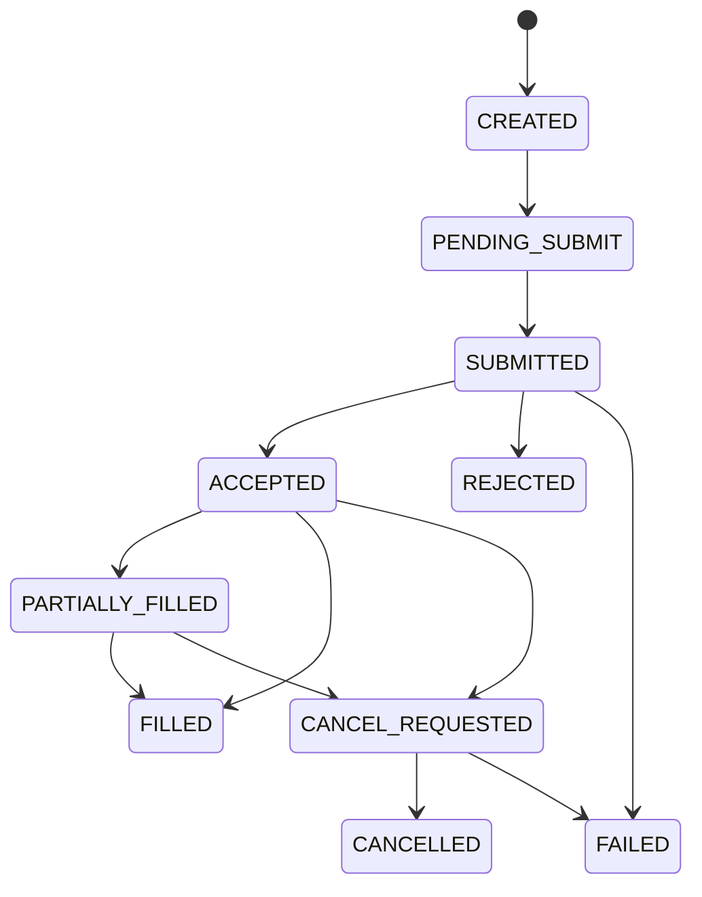

# TradingClaw 交易网关详细设计

## 1. 范围说明

- 本文档覆盖 `trade-gateway-service`。
- 对应需求主要包括 `UTL-001`，并承接证券交易和数字资产交易的统一抽象。
- 本模块是交易主链路中台，不直接实现券商或交易所协议细节。

## 1.1 相关文档

- 总体总览：`docs/详细设计/service/后端详细设计.md`
- 用户与账户：`docs/详细设计/service/用户与账户详细设计.md`
- 证券交易：`docs/详细设计/service/证券交易详细设计.md`
- 数字资产交易：`docs/详细设计/service/数字资产交易详细设计.md`
- 策略系统：`docs/详细设计/service/策略系统详细设计.md`
- 风控审计与通知：`docs/详细设计/service/风控审计与通知详细设计.md`

## 2. 模块职责

- 提供统一下单、撤单、查单、持仓、成交、余额模型。
- 根据资产类别和账户类型路由到证券或数字资产适配域。
- 统一幂等控制、错误码转换、状态映射、审计留痕。
- 对上游策略、AI、客户端提供稳定交易语义。

## 3. 领域边界

- 统一交易事实由本模块持有主权。
- 通道登录、原始回报抓取、券商/交易所协议解析由下游适配域负责。
- 风控裁决由 `audit-risk-service` 提供，本模块负责在执行前接入裁决链。

## 4. 核心领域模型

| 对象 | 说明 |
| --- | --- |
| `TradingAccount` | 统一交易账户 |
| `TradingSession` | 统一交易会话 |
| `Instrument` | 交易标的 |
| `Order` | 统一订单 |
| `ExecutionReport` | 执行回报 |
| `Fill` | 成交记录 |
| `Position` | 持仓视图 |
| `Balance` | 资金视图 |

状态必须区分三层：

- 外部通道原始状态
- 内部统一领域状态
- 对外展示标准状态

## 5. 核心业务流程

### 5.1 统一下单

1. 接收统一下单命令。
2. 校验会话、账户归属、幂等键、风控裁决。
3. 创建 `Order` 主记录并生成内部状态。
4. 根据账户类型路由至证券或数字资产适配域。
5. 接收首个结果并映射为统一返回。
6. 发布 `order.created` 和后续状态事件。

### 5.2 统一撤单

1. 校验订单归属和当前状态。
2. 将订单推进至 `CANCEL_REQUESTED`。
3. 路由至目标通道适配域执行撤单。
4. 根据结果推进到 `CANCELLED`、`FAILED` 或继续等待回报。

### 5.3 订单状态推进

1. 接收 `execution.report_received` 事件。
2. 做去重、乱序防护和状态机校验。
3. 更新统一订单、成交、持仓、余额视图。
4. 发布标准化订单事件供策略、通知、审计消费。

## 6. 状态机

### 6.1 统一订单状态机

### 6.2 交易会话状态机

- `UNINITIALIZED`
- `AUTHENTICATING`
- `AVAILABLE`
- `DEGRADED`
- `EXPIRED`
- `FAILED`
- `CLOSED`

规则：

- `AVAILABLE` 才允许真实交易写操作。
- `DEGRADED` 默认只允许查，不允许高风险写。
- `EXPIRED` 可通过工作流触发重认证。

## 7. 数据设计

核心表：

- `orders`
- `order_requests`
- `order_channel_mappings`
- `executions`
- `execution_reports`
- `positions_snapshots`
- `balances_snapshots`
- `trading_sessions`

## 8. 事件设计

核心事件：

- `order.created`
- `order.accepted`
- `order.rejected`
- `order.partially_filled`
- `order.filled`
- `order.cancel_requested`
- `order.cancelled`
- `order.failed`
- `trading_session.expired`

## 9. 接口设计

### 9.1 HTTP 入口

- `/api/v1/trades/orders`
- `/api/v1/trades/orders/{id}/cancel`
- `/api/v1/trades/orders/{id}`
- `/api/v1/trades/positions`

### 9.2 gRPC 服务

- `OrderService`
- `PositionService`
- `BalanceService`

## 10. 依赖与实施顺序

- 本模块建议在身份账户和行情基础就绪后优先实现。
- 证券交易和数字资产交易模块必须通过本模块对外暴露统一能力。
- 策略系统不能绕过本模块直接访问通道适配服务。
