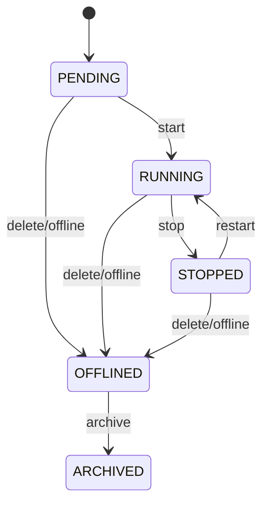

# TradingClaw 策略系统详细设计

## 1. 范围说明

- 本文档覆盖 `strategy-service`、`strategy-runtime-service`、`portfolio-calculation-service`。
- 对应需求主要包括 `STR-001` ~ `STR-004`。
- 本模块承载策略管理、策略运行时和纯计算内核，是系统核心业务闭环。

## 1.1 相关文档

- 总体总览：`docs/详细设计/service/后端详细设计.md`
- 用户与账户：`docs/详细设计/service/用户与账户详细设计.md`
- 行情与资讯：`docs/详细设计/service/行情与资讯详细设计.md`
- 交易网关：`docs/详细设计/service/交易网关详细设计.md`
- 风控审计与通知：`docs/详细设计/service/风控审计与通知详细设计.md`

## 2. 模块职责

### 2.1 `strategy-service`

- 策略定义、实例创建、配置修改、查询、停止、归档。
- 维护策略实例生命周期状态机。

### 2.2 `strategy-runtime-service`

- 策略调度、事件消费、快照恢复、执行补偿。
- 驱动工作流、调用计算内核和交易网关。

### 2.3 `portfolio-calculation-service`

- 提供网格、马丁、动态平衡、定投等纯计算能力。
- 不直接访问交易通道，不持有执行副作用。

## 3. 核心领域模型

| 对象 | 说明 |
| --- | --- |
| `StrategyDefinition` | 策略模板定义 |
| `StrategyInstance` | 用户策略实例 |
| `StrategyConfig` | 策略配置快照 |
| `StrategyExecution` | 运行时上下文 |
| `StrategySnapshot` | 恢复快照 |
| `StrategySignal` | 计算产生的信号 |
| `TradingPlan` | 待执行交易计划 |
| `RiskDecision` | 风控裁决结果 |

## 4. 核心流程

### 4.1 策略创建与启动

1. 接收创建策略请求。
2. 校验用户会话、账户归属、额度和参数。
3. 创建 `StrategyInstance` 与初始配置。
4. 触发 `StrategyStartWorkflow`。
5. 运行时加载快照、订阅行情并进入就绪状态。

### 4.2 策略执行闭环

1. 运行时收到行情、订单或定时器触发。
2. 调用 `portfolio-calculation-service` 计算信号。
3. 生成 `TradingPlan`。
4. 接入风控裁决。
5. 通过交易网关执行订单。
6. 根据回报更新快照和策略状态。

### 4.3 策略恢复

1. 检测到服务异常恢复、节点迁移或工作流恢复。
2. 根据 `StrategySnapshot` 重建运行上下文。
3. 恢复行情订阅、未完成计划和订单跟踪。
4. 根据结果继续执行、补偿或暂停。

## 5. 状态机

### 5.1 策略实例状态机

### 5.2 运行时状态机

- `INIT`
- `READY`
- `EVALUATING`
- `PLANNING`
- `EXECUTING`
- `WAITING_EVENT`
- `RECOVERING`
- `PAUSED`
- `TERMINATED`

## 6. 策略插件接口

- `validate(config, context)`
- `prepare(snapshot)`
- `evaluate(market, account, positions, config)`
- `generatePlan(signal)`
- `applyRisk(plan)`
- `execute(planRef)`
- `reconcile(executions)`

规则：

- `validate` 到 `generatePlan` 属于纯计算域。
- `execute` 和 `reconcile` 由运行时编排驱动。

## 7. 数据设计

核心表：

- `strategy_definitions`
- `strategy_instances`
- `strategy_configs`
- `strategy_snapshots`
- `strategy_signals`
- `trading_plans`
- `strategy_executions`
- `strategy_archives`

## 8. 事件设计

核心事件：

- `strategy.created`
- `strategy.started`
- `strategy.stopped`
- `strategy.offlined`
- `strategy.archived`
- `strategy.snapshot_saved`
- `strategy.signal.generated`
- `trading_plan.generated`
- `trading_plan.executed`

## 9. 接口设计

### 9.1 HTTP 入口

- `/api/v1/strategies`
- `/api/v1/strategies/{id}`
- `/api/v1/strategies/{id}/start`
- `/api/v1/strategies/{id}/stop`
- `/api/v1/strategies/{id}/archive`

### 9.2 gRPC 服务

- `StrategyCommandService`
- `StrategyQueryService`
- `StrategyEvaluationService`

### 9.3 工作流

- `StrategyStartWorkflow`
- `StrategyRecoveryWorkflow`
- `GridRebuildWorkflow`

## 10. 依赖与实施顺序

- 本模块建议在身份账户、行情、交易网关和风控裁决基础能力稳定后实施。
- 是业务闭环的核心模块，应单独做容量、恢复、回放验证。
- 任何策略类型扩展都应通过插件和配置扩展完成，不应修改公共主链路。
